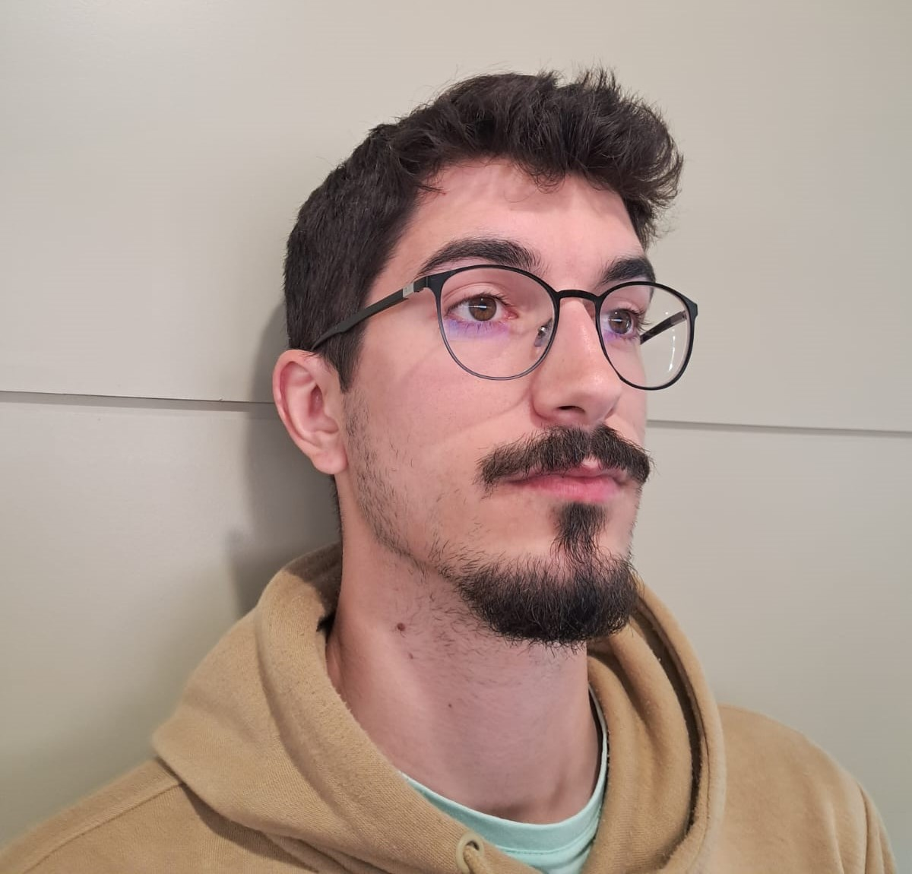
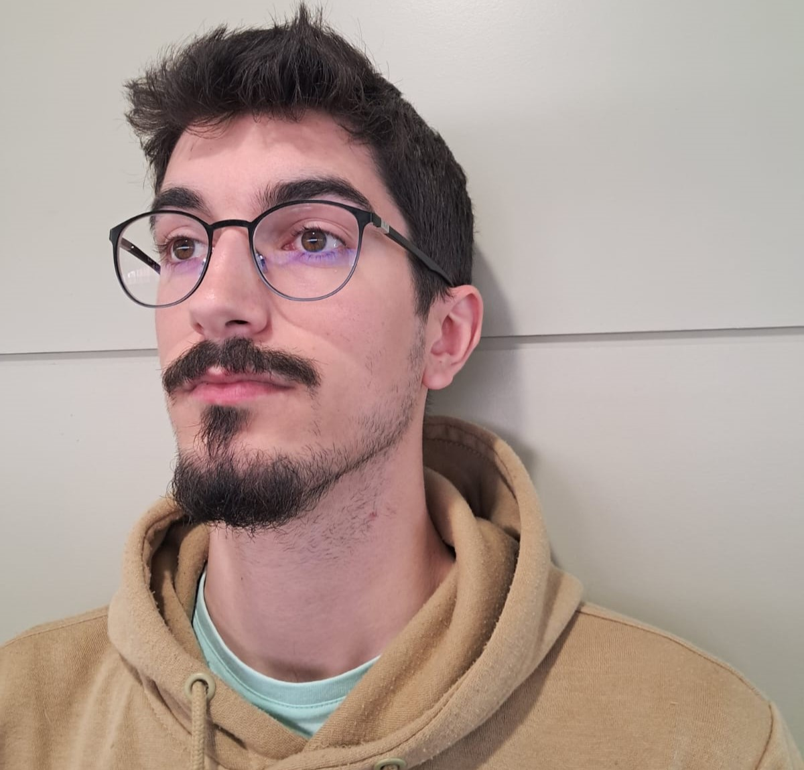

### Autors | Autores | Authors:
* Pol Colomer Campoy (1605612)
* Gerard Josep Guarin Velez (1605947)
* Jan Rubio Rico (1603753)

### Selecciona un idioma | Select a language:
* <a href="#catala">Català</a>
* <a href="#castellano">Castellano</a>
* <a href="#english">English</a>
---
<h1 id="catala"> Visió per Computador - Implementació de l'algorisme SIFT i modelat 3D </h1>

En aquest directori es troba tota la implementació en Python del projecte de Visió per Computador, en el qual hem 
implementat el nostre algorisme SIFT (Scale Invariant Feature Transform) personal, el qual troba punts característics i 
descriptors de les imatges d'entrada. Addicionalment, hem realitzat una primera reconstrucció d'un model 3D, mitjançant 
diverses tècniques que explicarem més endavant, visualitzant un núvol de punts 3D.

Com bé s'ha anat comentant durant tot aquest repositori, aquest projecte està connectat també amb les assignatures de 
Robòtica i Sistemes Multimèdia. Mitjançant aquestes tres assignatures, hem desenvolupat un braç robòtic quirúrgic 
de control remot per tal de controlar-lo remotament, comptem amb una càmera al robot, la qual realitza dues imatges de 
la cara del pacient. Justament en aquesta part ens centrarem en aquesta assignatura, perquè volem que el cirurgià des de 
l'altra punta del món pugui visualitzar un núvol de punts de la cara del pacient per tal de dur a terme l'operació.

## SIFT (Scale Invariant Feature Transform)

L'algoritme SIFT és especialment útil per detectar punts característics invariants a canvis d'escala, rotació i 
il·luminació en una imatge. El procés de detecció es realitza mitjançant diverses etapes. Primerament, s'aplica una 
piràmide d'escala per identificar punts potencials en diferents nivells de resolució. 
Després, s'utilitza un algoritme de detecció de punts clau per identificar les regions amb característiques distintives,
com ara cantonades i regions amb canvis bruscs d'intensitat.
Un cop es detecten els punts clau, l'algoritme SIFT calcula un descriptor per a cada punt. Aquests descriptors són 
vectors numèrics que capturen les característiques locals de la regió entorn de cada punt clau, com ara la direcció del 
gradient i la magnitud. Això permet comparar i emparellar punts característics entre diferents imatges, ja que els 
descriptors són robustos davant de canvis geomètrics i fotomètrics.

L'algoritme SIFT ha estat àmpliament utilitzat en diverses aplicacions de visió per ordinador, com ara la 
correspondència d'imatges, el reconeixement d'objectes i la reconstrucció tridimensional. La seva robustesa i 
invariància a diferents transformacions han contribuït a la seva popularitat i la seva aplicabilitat en diferents àrees.

### SIFT Manual:
Molt bé, ara que coneixem què és l'algorisme SIFT, explicarem els passos principals en què hem implementat l'algorisme.
En total consta de 4 passos:

1. **Obtenció de key points:** Per l'obtenció de key points, o punts característics, s'ha de convolucionar la imatge amb
una màscara Gaussiana, donant com a resultat una imatge suavitzada o `scale`. Hem de generar `n` escales per després 
aconseguir un espai de diferències Gaussianes. Cada imatge suavitzada nova es genera amb una màscara amb la qual té la 
`sigma` utilitzada en la creació de la imatge suavitzada anterior per un hiperparàmetre `k^n`. Les imatges suavitzades 
estan agrupades en `octaves`. Les `octaves` es diferencien en el fet que es redueix la resolució. En cada octava els 
pixeles tenen una resolució de `2^n de l'Octava`. Quan obtenim els espais de Diferències de Gaussianes, restem a cada 
imatge suavitzada nova a l'anterior, iterem per cada píxel de la imatge resultant i si el píxel és un màxim o un mínim 
en l'espai `3x3x3` al seu voltant, es considera un keypoint.

2. **Refining keypoint location:** En aquest apartat es refinen breument les posicions dels keypoints, perquè s'obté la 
posició 'exacta' d'aquests mentre que fins ara la seva posició està limitada a un enter, és a dir a un píxel en concret.
Per a aconseguir aquesta aproximació, s'han d'implementar la funció de segon ordre de Taylor i la matriu Hessiana. A 
causa de la poca diferència dels resultats aplicant aquest pas o no aplicant-lo i al temps que implicaria implementar 
aquest apartat, no s’ha implementat.

3. **Orientació dels keypoints:** Una vegada tenim els key points, calculem quina orientació tenen. Per això, hem de fer
una finestra al voltant del keypoint de mida `3*1.5*escala del píxel`. En aquesta finestra calculem els gradients de 
cada píxel per a continuació aconseguir les seves magnituds i orientacions. En un histograma de 36 `bins`, 1 per cada 10 
graus, anem afegint el valor dels pesos de cada píxel. Per assignar els pesos, hem calculat la mitja entre `1.5*escala` 
i la magnitud del píxel. Una vegada iterat tots els píxels de la finestra al voltant del keypoint, es tria l'angle del 
`bin` amb valor màxim com l’orientació del key point. Per cada altre `bin` que tingui un valor igual o mayor al 
`0.8 del bin màxim`, es creen nous key points a la mateixa posició però amb l’orientació diferent.

4. **Construcció dels descriptors:** Per la construcció dels descriptors s’ha d'observar una àrea de `16x16 píxels` al 
voltant del key point. En aquesta àrea es creen `descriptors de 4x4`. Dins de cada descriptor es calcula un histograma
d'orientacions de `8 bins`. Per tal d’omplir l’histograma es fa el mateix que al pas anterior, es calcula els gradients
per després calcular les orientacions i magnituds de cada píxel. A cada orientació del nou histograma d'orientacions se
li resta l'orientació dominant del píxel del pas **3.** perquè siguin relatives a aquesta. Una vegada calculats tots els 
histogrames de cada descriptor `4x4` es concatenen els `bins` donant com a resultat el descriptor del key point el qual 
s’utilitza quan es vol fer match amb key points d’una altra imatge.

## Procés de reconstrucció - Modelatge 3D a partir de dues imatges utilitzant SIFT.

Tal i com s'explica al títol, en aquest apartat explicarem quin procés hem realitzat per tal d'acomplir el repte proposat de generar un mapa de punts 3D donades dues imatges.

### Passos per a la reconstrucció:

1. **Dades proporcionades:** Primerament, rebrem dues imatges, en el nostre projecte del robot, les imatges proporcionades seràn les dues que realitza la càmera de la Raspberry Pi.
Posarem dues imatges de prova d'un dels membres del grup (Pol Colomer Campoy) per tal de fer l'explicació de manera més visual:

   

  

A partir d'ara: `Imatge 1 o input 1` A partir d'ara: `Imatge 2 o input 2`  

2. **Calcular SIFT:** A continuació es realitza l'algorisme SIFT, el qual ja sabem com funciona degut a l'explicació anterior. Aplicarem l'algorisme SIFT per a cada imatge per tal d'obtenir els `keypoints` i `descriptors` de cada una.
3. **Matching:** Una vegada hem obtingut els descriptors de cada imatge, realitzarem el matching dels punts que es troben en les dues imatges alhora, nosaltres hem utilitzat FLANN per fer cerques ràpides entre veïns propers (coincidències de descriptors == Match)
4. **Good Matches:** Del pas anterior, hem trobat molts matches, és a dir, molts punts característics que es trobaven alhora en les dues imatges, però el més segur és que molts d'aquests siguin càlculs erronis degut a la similaritud de diversos sectors de la imatge. És per això per el que realtizarem un filtratge dels matches per tal de quedar-nos amb els "Good Matches" o matches confiables. Per calcular-los, apliquem el test de Lowe's (Lowe's Ratio Test) o "prova de ràtio de pendent". 
5. 
