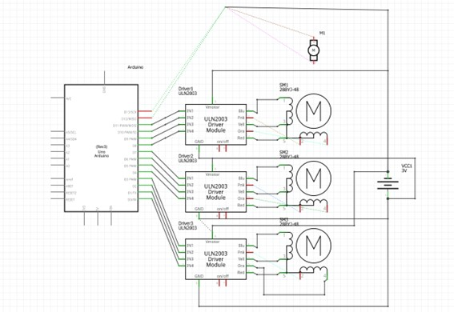
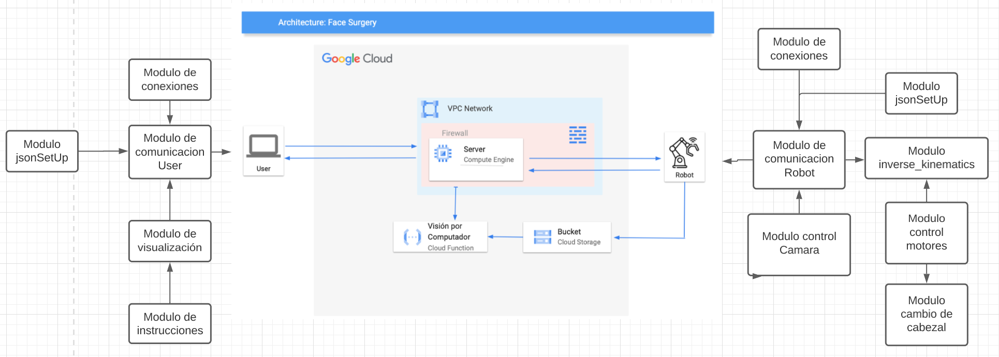
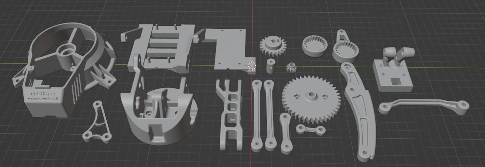

### Selecciona un idioma | Select a language:
* <a href="#catala">Català</a>
* <a href="#castellano">Castellano</a>
* <a href="#english">English</a>

# [Click to see our YouTube Results Video](https://www.youtube.com/watch?v=n3rDo8sf0jU&ab_channel=JanRubio)
[](https://www.youtube.com/watch?v=n3rDo8sf0jU&ab_channel=JanRubio "MultiArm")

---

  
<h1 id="catala"> MultiArm </h1>
Projecte conjunt de les assignatures de Robòtica (RLP), Visió per Computador (VC) i Sistemes Multimèdia (SM) en el qual hem desenvolupat un braç robotic amb visió per computador per a realitzar operacions quirúrgiques remotament via Internet.


# Taula de continguts:
   * [Què és aquest repositori?](#què-és-aquest-repositori)
   * [Requisits](#requisits)
     * [Hardware](#hardware)
     * [Software](#software)
   * [Documentació](#documentació)
   * [Guia d'ús](#guia-dús)
   * [Esquema del Hardware](#esquema-del-hardware)
   * [Arquitectura del Software](#arquitectura-del-software)
   * [Models 3D](#models-3d)
   * [Millores en un futur](#millores-en-un-futur)
   * [Autors](#autors)

# Què és aquest repositori?

En aquest repositori es troba tot el codi, models del robot explicació necessaris per tal d'entendre què hem fet durant el procés de desenvolupament d'aquest projecte amb l'objectiu de poder replicar-lo i millorar-lo en un futur.

### Codi.
Trobem el codi separat en 3 carpetes principals:
- **robot:** En aquesta carpeta es troba tot el codi d'Arduino desenvolupat i els models 3D del robot.
- **cloud:** S'hi pot trobar el codi que s'ha d'executar per tal de controlar remotament el robot. Tenim el servidor, el client del robot, el client de l'usuari i l'aplicació.
- **Computer Vision:** Conté el codi implementat durant la realització de la pràctica de Visió per Computador, durant la qual vam implementar l'algorisme SIFT manual, el procés necessari per realitzar una primera reconstrucció donades dues imatges i la comparació de diversos algorismes similars.

# Requisits:

Llistarem els requisits necessaris per portar a terme el nostre projecte, tant el muntatge del robot (sense comptar cables, cargols, etc) com 
l'execució del nostre Software amb les dependències o requeriments que comportin.

## Hardware:
- 3 x motor pas a pas (28BYJ-48)
- 3 x  Controladora de motors de pas a pas (28BYJ-48) (Controladora ULN2003 7 IN pins i de 5-12V)
- 1 x Micro Metal Gearmotor HP (micromotor de gir Continu)
- 1 x Controladora de motor (micromotor de gir) DF-MD V1.3
- 1 x Fuente de alimentación TACENS anima APII 500
- 1 x Placa de prototipo (Protoboard) 16,5x5,5cm
- 1 x Arduino UNO Rev.3
- 1 x Raspberry pi Zero
- 1 x Mòdul de càmera Raspberry Pi Camera v2

## Software:
- [Python 3.10.x](https://www.python.org/)
  - [NumPy](https://numpy.org/)
  - [PyGame](https://www.pygame.org/news)
  - [cv2 (openCV)](https://pypi.org/project/opencv-python/)
  - [time](https://docs.python.org/3/library/time.html)
  - [sys](https://docs.python.org/3/library/sys.html)
  - [socket](https://docs.python.org/3/library/socket.html)
  - [picamera](https://picamera.readthedocs.io/en/latest/)
  - [serial](https://pyserial.readthedocs.io/en/latest/)
  - [google-cloud](https://googleapis.dev/python/google-api-core/latest/index.html)
  - [google-cloud-storage](https://googleapis.dev/python/storage/latest/index.html)
  - [google-auth](https://google-auth.readthedocs.io/en/latest/)
  - [google-auth-oauthlib](https://google-auth-oauthlib.readthedocs.io/en/latest/)
  - [google.oauth2](https://google-auth.readthedocs.io/en/latest/reference/google.oauth2.html)
  - [json](https://docs.python.org/3/library/json.html)
  - [Flask](https://flask.palletsprojects.com/en/2.3.x/)
- [Arduino IDE](https://www.arduino.cc/en/software)
  - [AccelStepper - Arduino Library](https://www.airspayce.com/mikem/arduino/AccelStepper/)
- [Google Cloud Platform (GCP)](https://cloud.google.com/gcp/)

# Documentació:
Aquest README conté informació del nostre robot, i un context general de les parts de visió per computador i del Cloud, desenvolupat a Sistemes Multimèdia.
Si estàs interessat en conèixer més detalls dels respectius projectes, pots mirar:
* [Visió per Computador: Implementació de l'algorisme SIFT i modelat 3D](https://github.com/GerardGV/MultiArm/tree/main/Computer%20Vision) on aprofundim més sobre l'algorisme implementat per detectar punts característics de dues imatges i després visualitzar-los en l'aplicació.
* [Sistemes Multimèdia: Projecte al Cloud](https://github.com/GerardGV/MultiArm/tree/main/cloud) on aprofundim més sobre l'arquitectura de comunicacions desenvolupada en el Cloud allotjat a Google Cloud, l'aplicació, el seu funcionament i peticions amb el servidor realitzades.

# Guia d'ús:
1. Clone this repository.
    ```terminal
    git clone https://github.com/GerardGV/MultiArm.git
    ```
2. Install Python and the required libraries. 
    ```terminal
    pip install -r requirements.txt
    ```
3. Open the server (execute the cloud/server.py) file
    ```terminal
    python3 cloud/server.py
    ```
4. Open the App (execute the cloud/app.py)
    ```terminal
    python3 cloud/app.py
    ```
5. Open the clientRobot.py and turn on the Robot
    ```terminal
    python3 cloud/clientRobot.py
    ```
6. Enjoy!! 😄 TIP: You can check the Cloud folder README.md to understand the WorkFlow of our app. 

# Esquema del Hardware
<p align="center">
  
</p>
Nota: El motor DC M1 está connectat a una controladora que el programa Fritzing no mostra a l'esquema. 
El nostre esquema de HW esta compost pels 3 motors steppers connectats cadascún a la seva controladora i als pins correspondents a la Arduino i un motor DC connectat a la seva controladora i als pins 12 i 13 d’Arduino. Tots aquests motors estan connectats a una font d’alimentació.

# Arquitectura del Software
<p align="center">
  
</p>

- Mòdul comunicació User: funció que rep els següents paràmetres:  
  - Socket: socket connectat al servidor.  
  - Instrucció: funcionalitat del missatge.  
  - Missatge: la informació que es desitja enviar.  
  - Amb aquests paràmetres cridarà al mòdul de jsonSetUp i formalitzarà un json per enviar a través del socket.  
- Mòdul de Visualització: visualització del rostre escanejat en un espai 2D, segons la versió de l'aplicació que s'utilitzi.  
- Mòdul jsonSetUp: formalitza els paràmetres instruction i message per retornar un json.  
- Mòdul de connexions: rep una IP i el port per retornar una connexió socket.  
- Mòdul d'instruccions: menú a l'aplicació de l'usuari per rebre les ordres.  
- Mòdul User: aplicació formada pels mòduls de visualització i d'instruccions en conjunt amb un mòdul de connexió que permet comunicar-se via socket amb el servidor.  
- Cloud function: algorisme de visió per computador que retorna els punts característics de les dues imatges enviades del robot al cloud storage bucket.  
- Mòdul server: màquina virtual que executa un Python script que permet les connexions via socket amb l'User i el robot. Té regles firewall afegides en la seva xarxa del cloud per permetre les connexions.  
- Mòdul Bucket, cloud storage: emmagatzema les imatges fetes però el braç robòtic.  
- Mòdul Robot: Python script format per un mòdul de connexió i que envia les ordres a l'arduino perquè cridi als mòduls corresponents.  
- Mòdul control Càmera: rep la instrucció de captar les dades biomètriques.  
- Mòdul Control de Motors: rep les ordres de moviment per a cada motor.  
- Mòdul canvi de capçal: mòdul al qual crida el robot quan vol canviar de capçal. Si no té cap capçal, anirà i agafarà l'1, el retolador, si té el retolador, anirà a deixar el segon capçal.  
- Mòdul control càmera: mòdul que retorna imatges fetes per la càmera de la raspberry.  
- Mòdul inverse_kinematics: mòdul de l'arduino que rep les instruccions de la raspberry i crida a control de motors segons la instrucció.  
- Mòdul comunicació Robot: rep la connexió socket i envia les ordres al robot, arduino, i retorna informació al servidor, les imatges.  
                                                                                  
# Models 3D: 
<p align="center">
  
</p>

En aquesta imatge trobem els diversos models 3D que formen el nostre robot. En el nostre cas, els hem imprès mitjançant una impresora 3D amb PLA.

# Millores en un futur:
* Millorar la visualització de punts per tal que es realitzi una visualització de punts 3D millor. Desenvolupar el software necessari per tal que tota l'aplicació funcioni amb aquesta visualització implementada que permeti rotar la càmera: 

* Millorar l'algorísmica del robot per controlar millor la profunditat i evitar tallades al pacient, però per millorar això, és necessari que per la part de Visió per Computador s'aconsegueixi fer un meshing i texturització del model per tal de detectar correctament tots els punts amb precisió. D'aquesta manera hi hauria millor interacció Cirurgià - Robot. Aquesta feina és complicada i s'hi ha de dedicar molt de temps, però creiem que és un coll d'ampolla important a superar, doncs el canvi que es pot realitzar en el projecte és gran.
* Controlar la temperatura dels motors, millorar la refrigeració o canviar el material de construcció del robot, ja que després de bastantes proves o d'execucions llargues, els engranatges més petits que es troben en contacte directe amb els motors es fonen, perdent així moviment del robot.

# Autors:
* Pol Colomer Campoy (1605612) | PolKinsa
* Gerard Josep Guarin Velez (1605947) | GerardGV
* Jan Rubio Rico (1603753) | TheRospetit
* Rubén Simó Marin (1569391)
---
---

<h1 id= "castellano"> MultiArm </h1>
Proyecto conjunto de las asignaturas de Robótica (RLP), Visión por Computadora (VC) y Sistemas Multimedia (SM) en el cual hemos desarrollado un brazo robótico con visión por computadora para realizar operaciones quirúrgicas de manera remota a través de Internet.

## Tabla de contenidos:
   * [¿Qué es este repositorio?](#qué-es-este-repositorio)
   * [Requisitos](#requisitos)
     * <a href="hardware-es">Hardware</a>
     * <a href="#software-es">Software</a>
   * [Documentación](#documentación)
   * [Guía de uso](#guía-de-uso)
   * [Esquema del Hardware](#esquema-del-hardware)
   * [Arquitectura del Software](#arquitectura-del-software)
   * [Modelos 3D](#modelos-3d)
   * [Mejoras en un futuro](#mejoras-en-un-futuro)
   * [Autores](#autores)

# ¿Qué es este repositorio?

En este repositorio se encuentra todo el código, modelos del robot y explicaciones necesarias para entender lo que hemos hecho durante el proceso de desarrollo de este proyecto, con el objetivo de poder replicarlo y mejorarlo en el futuro.

### Código.
El código está organizado en 3 carpetas principales:
- **robot:** En esta carpeta se encuentra todo el código de Arduino desarrollado y los modelos 3D del robot.
- **cloud:** Aquí se puede encontrar el código que se debe ejecutar para controlar remotamente el robot. Tenemos el servidor, el cliente del robot, el cliente del usuario y la aplicación.
- **Computer Vision:** Contiene el código implementado durante la realización de la práctica de Visión por Computadora, en la cual implementamos el algoritmo SIFT manual, el proceso necesario para realizar una reconstrucción inicial dadas dos imágenes y la comparación de varios algoritmos similares.

# Requisitos:

Enumeraremos los requisitos necesarios para llevar a cabo nuestro proyecto, tanto el ensamblaje del robot (sin contar cables, tornillos, etc.) como la ejecución de nuestro Software con las dependencias o requerimientos que conlleve.

<h2 name="hardware-es"> Hardware: </h2>
- 3 x motor paso a paso (28BYJ-48)
- 3 x Controladora de motores paso a paso (28BYJ-48) (Controladora ULN2003 con 7 pines IN y voltaje de 5-12V)
- 1 x Micro Motor de Engranajes HP (micromotor de giro continuo)
- 1 x Controladora de motor (micromotor de giro) DF-MD V1.3
- 1 x Fuente de alimentación TACENS anima APII 500
- 1 x Placa de prototipo (Protoboard) 16,5x5,5cm
- 1 x Arduino UNO Rev.3
- 1 x Raspberry Pi Zero
- 1 x Módulo de cámara Raspberry Pi Camera v2
- 
<h2 name="software-es"> Software: </h2>

- [Python 3.10.x](https://www.python.org/)
  - [NumPy](https://numpy.org/)
  - [PyGame](https://www.pygame.org/news)
  - [cv2 (openCV)](https://pypi.org/project/opencv-python/)
  - [time](https://docs.python.org/3/library/time.html)
  - [sys](https://docs.python.org/3/library/sys.html)
  - [socket](https://docs.python.org/3/library/socket.html)
  - [picamera](https://picamera.readthedocs.io/en/latest/)
  - [serial](https://pyserial.readthedocs.io/en/latest/)
  - [google-cloud](https://googleapis.dev/python/google-api-core/latest/index.html)
  - [google-cloud-storage](https://googleapis.dev/python/storage/latest/index.html)
  - [google-auth](https://google-auth.readthedocs.io/en/latest/)
  - [google-auth-oauthlib](https://google-auth-oauthlib.readthedocs.io/en/latest/)
  - [google.oauth2](https://google-auth.readthedocs.io/en/latest/reference/google.oauth2.html)
  - [json](https://docs.python.org/3/library/json.html)
  - [Flask](https://flask.palletsprojects.com/en/2.3.x/)
- [Arduino IDE](https://www.arduino.cc/en/software)
  - [AccelStepper - Arduino Library](https://www.airspayce.com/mikem/arduino/AccelStepper/)
- [Google Cloud Platform (GCP)](https://cloud.google.com/gcp/)

# Documentación:
Este README contiene información de nuestro robot y un contexto general de las partes de visión por computadora y de Cloud desarrolladas en Sistemas Multimedia.
Si estás interesado en conocer más detalles de los respectivos proyectos, puedes mirar:
* [Visión por Computadora: Implementación del algoritmo SIFT y modelado 3D](https://github.com/GerardGV/MultiArm/tree/main/Computer%20Vision), donde profundizamos más sobre el algoritmo implementado para detectar puntos característicos en dos imágenes y luego visualizarlos en la aplicación.
* [Sistemas Multimedia: Proyecto en el Cloud](https://github.com/GerardGV/MultiArm/tree/main/cloud), donde profundizamos más sobre la arquitectura de comunicaciones desarrollada en el Cloud alojado en Google Cloud, la aplicación, su funcionamiento y las solicitudes realizadas al servidor.

# Guía de uso:
1. Clona este repositorio.
    ```terminal
    git clone https://github.com/GerardGV/MultiArm.git
    ```
2. Instala Python y las bibliotecas requeridas. 
    ```terminal
    pip install -r requirements.txt
    ```
3. Abre el archivo server.py en la carpeta cloud y ejecútalo.
    ```terminal
    python3 cloud/server.py
    ```
4. Abre la aplicación (ejecuta el archivo app.py en la carpeta cloud).
    ```terminal
    python3 cloud/app.py
    ```
5. Abre el archivo clientRobot.py y enciende el robot.
    ```terminal
    python3 cloud/clientRobot.py
    ```
6. ¡Disfruta! 😄 CONSEJO: Puedes consultar el archivo README.md de la carpeta Cloud para comprender el flujo de trabajo de nuestra aplicación.

# Esquema del Hardware
<p align="center">
  
</p>
Nota: El motor DC M1 está conectado a un controlador que el programa Fritzing no muestra en el esquema. 
Nuestro esquema de HW está compuesto por los 3 motores paso a paso conectados cada uno a su controlador y a los pines correspondientes en Arduino, y un motor DC conectado a su controlador y a los pines 12 y 13 de Arduino. Todos estos motores están conectados a una fuente de alimentación.

# Arquitectura del Software
<p align="center">
  
</p>

- Módulo comunicación User: función que recibe los siguientes parámetros:
  - Socket: socket conectado al servidor.
  - Instrucción: funcionalidad del mensaje.
  - Mensaje: la información que se desea enviar.
  - Retorna puntos 2D en caso de solicitarlo.
  - Con estos parámetros, llamará al módulo jsonSetUp y formalizará un json para enviar a través del socket.
- Módulo de Visualización: visualización del rostro escaneado en un espacio 2D, según la versión de la aplicación que se esté utilizando.
- Módulo jsonSetUp: formaliza los parámetros de instrucción y mensaje para retornar un json.
- Módulo de conexiones: recibe una dirección IP y un puerto para establecer una conexión socket.
- Módulo de instrucciones: menú en la aplicación del usuario para recibir las órdenes.
- Módulo User: aplicación formada por los módulos de visualización e instrucciones, junto con un módulo de conexión que permite la comunicación vía socket con el servidor.
- Cloud function: algoritmo de visión por computadora que retorna los puntos característicos de las dos imágenes enviadas del robot al cloud storage bucket.
- Módulo server: máquina virtual que ejecuta un script de Python que permite las conexiones vía socket con el User y el robot. Tiene reglas de firewall agregadas en su red del cloud para permitir las conexiones.
- Módulo Bucket, cloud storage: almacena las imágenes tomadas por el brazo robótico.
- Módulo Robot: script de Python compuesto por un módulo de conexión que envía las órdenes al Arduino para que llame a los módulos correspondientes.
- Módulo control Cámara: recibe la instrucción de capturar los datos biométricos.
- Módulo Control de Motores: recibe las órdenes de movimiento para cada motor.
- Módulo cambio de cabezal: modelo al que llama el robot cuando quiere cambiar de cabezal. Si no tiene ningún cabezal, irá y tomará el primero, el rotulador; si tiene el rotulador, irá a dejar el segundo cabezal.
- Módulo control cámara: módulo que devuelve imágenes tomadas por la cámara de la Raspberry.
- Módulo inverse_kinematics: módulo del Arduino que recibe las instrucciones de la Raspberry y llama a control de motores según la instrucción.
- Módulo comunicación Robot: recibe la conexión socket y envía las órdenes al robot (Arduino) y retorna información al servidor, como las imágenes.

# Modelos 3D:
<p align="center">
  
</p>

En esta imagen encontramos los diversos modelos 3D que forman nuestro robot. En nuestro caso, los hemos impreso mediante una impresora 3D con PLA.

# Mejoras en un futuro:
* Mejorar la visualización de puntos para que se realice una visualización de puntos 3D mejorada. Desarrollar el software necesario para que toda la aplicación funcione con esta visualización implementada que permita rotar la cámara:

* Mejorar la algorítmica del robot para controlar mejor la profundidad y evitar cortes en el paciente. Sin embargo, para mejorar esto, es necesario lograr un meshing y texturización del modelo en la parte de Visión por Computadora para detectar correctamente todos los puntos con precisión. De esta manera, habría una mejor interacción Cirujano-Robot. Este trabajo es complicado y requiere mucho tiempo, pero creemos que es un desafío importante a superar, ya que el cambio que se puede lograr en el proyecto es significativo.
* Controlar la temperatura de los motores, mejorar la refrigeración o cambiar el material de construcción del robot, ya que después de muchas pruebas o ejecuciones prolongadas, los engranajes más pequeños que están en contacto directo con los motores se funden, perdiendo así el movimiento del robot.

# Autores:
* Pol Colomer Campoy (1605612) | PolKinsa
* Gerard Josep Guarin Velez (1605947) | GerardGV
* Jan Rubio Rico (1603753) | TheRospetit
* Rubén Simó Marin (1569391)

--- 
---

<h1 id="english">MultiArm</h1>
Joint project of the Robotics (RLP), Computer Vision (VC), and Multimedia Systems (SM) subjects in which we have developed a robotic arm with computer vision to perform surgical operations remotely via the Internet.


# Table of Contents:
   * [What is this?](#what-is-this)
   * [Requirements](#requirements)
     * <a href="hardware-en">Hardware</a>
     * <a href="#software-en">Software</a>
   * [Documentation](#documentation)
   * [How to use](#how-to-use)
   * [Hardware Scheme](#hardware-scheme)
   * [Software Architecture](#software-architecture)
   * [3D Models](#3d-models)
   * [Future Improvements](#future-improvements)
   * [Authors](#authors)

# What is this?

This repository contains all the necessary code, robot models, and explanations to understand what we have done during the development process of this project, with the aim of being able to replicate and improve it in the future.

### Code.
The code is organized into 3 main folders:
- **robot:** This folder contains all the developed Arduino code and 3D models of the robot.
- **cloud:** It contains the code that needs to be executed to remotely control the robot. We have the server, the robot client, the user client, and the application.
- **Computer Vision:** It includes the code implemented during the Computer Vision practice, during which we manually implemented the SIFT algorithm, the necessary process to perform an initial reconstruction given two images, and the comparison of various similar algorithms.

# Requirements:

We will list the necessary requirements to carry out our project, both the assembly of the robot (excluding cables, screws, etc.) and the execution of our software with the dependencies or requirements they entail.

<h2 name="hardware-en"> Hardware: </h2>

- 3 x Stepper Motor (28BYJ-48)
- 3 x Stepper Motor Controller (28BYJ-48) (ULN2003 7 IN pins controller and 5-12V)
- 1 x Micro Metal Gearmotor HP (Continuous rotation micro motor)
- 1 x Motor Controller (Gearmotor) DF-MD V1.3
- 1 x Power Supply TACENS anima APII 500
- 1 x Prototyping Board (Protoboard) 16.5x5.5cm
- 1 x Arduino UNO Rev.3
- 1 x Raspberry Pi Zero
- 1 x Raspberry Pi Camera Module v2

<h2 name="software-en" >Software: </h2>  

- [Python 3.10.x](https://www.python.org/)
  - [NumPy](https://numpy.org/)
  - [PyGame](https://www.pygame.org/news)
  - [cv2 (openCV)](https://pypi.org/project/opencv-python/)
  - [time](https://docs.python.org/3/library/time.html)
  - [sys](https://docs.python.org/3/library/sys.html)
  - [socket](https://docs.python.org/3/library/socket.html)
  - [picamera](https://picamera.readthedocs.io/en/latest/)
  - [serial](https://pyserial.readthedocs.io/en/latest/)
  - [google-cloud](https://googleapis.dev/python/google-api-core/latest/index.html)
  - [google-cloud-storage](https://googleapis.dev/python/storage/latest/index.html)
  - [google-auth](https://google-auth.readthedocs.io/en/latest/)
  - [google-auth-oauthlib](https://google-auth-oauthlib.readthedocs.io/en/latest/)
  - [google.oauth2](https://google-auth.readthedocs.io/en/latest/reference/google.oauth2.html)
  - [json](https://docs.python.org/3/library/json.html)
  - [Flask](https://flask.palletsprojects.com/en/2.3.x/)
- [Arduino IDE](https://www.arduino.cc/en/software)
  - [AccelStepper - Arduino Library](https://www.airspayce.com/mikem/arduino/AccelStepper/)
- [Google Cloud Platform (GCP)](https://cloud.google.com/gcp/)


# Documentation:
This README contains information about our robot and provides a general context of the computer vision and Cloud parts developed in Multimedia Systems. If you're interested in learning more details about the respective projects, you can check:
* [Computer Vision: Implementation of the SIFT algorithm and 3D modeling](https://github.com/GerardGV/MultiArm/tree/main/Computer%20Vision) where we delve deeper into the implemented algorithm for detecting characteristic points in two images and visualizing them in the application.
* [Multimedia Systems: Cloud Project](https://github.com/GerardGV/MultiArm/tree/main/cloud) where we delve deeper into the communication architecture developed in the Cloud hosted on Google Cloud, the application, its functioning, and the requests made with the server.

# How to use:
1. Clone this repository.
    ```terminal
    git clone https://github.com/GerardGV/MultiArm.git
    ```
2. Install Python and the required libraries. 
    ```terminal
    pip install -r requirements.txt
    ```
3. Open the server (execute the cloud/server.py) file
    ```terminal
    python3 cloud/server.py
    ```
4. Open the App (execute the cloud/app.py)
    ```terminal
    python3 cloud/app.py
    ```
5. Open the clientRobot.py and turn on the Robot
    ```terminal
    python3 cloud/clientRobot.py
    ```
6. Enjoy!! 😄 TIP: You can check the Cloud folder README.md to understand the Workflow of our app. 

# Hardware Scheme
<p align="center">
  
</p>
Note: The DC motor M1 is connected to a controller that is not shown in the Fritzing diagram. 
Our hardware scheme is composed of the 3 stepper motors connected to their respective controllers and the corresponding pins on Arduino, and a DC motor connected to its controller and pins 12 and 13 of Arduino. All these motors are connected to a power supply.

# Software Architecture
<p align="center">
  
</p>

- User Communication Module: a function that receives the following parameters:
  - Socket: socket connected to the server
  - Instruction: functionality of the message
  - Message: the information to be sent
  - Returns 2D points if requested
  - With these parameters, it calls the jsonSetUp module and formats a JSON to be sent through the socket.
- Visualization Module: visualization of the scanned face in a 2D space, depending on the version of the application being used.
- jsonSetUp Module: formats the instruction and message parameters to return a JSON.
- Connections Module: receives an IP and port to establish a socket connection.
- Instructions Module: user application menu to receive commands.
- User Module: application composed of the visualization and instructions modules together with a connection module that allows communication via socket with the server.
- Cloud Function: computer vision algorithm that returns the characteristic points of the two images sent by the robot to the Cloud Storage bucket.
- Server Module: virtual machine that runs a Python script allowing socket connections with the User and the robot. It has firewall rules added in its Cloud network to enable connections.
- Bucket Module, Cloud Storage: stores the images taken by the robotic arm.
- Robot Module: Python script composed of a connection module that sends commands to Arduino to call the corresponding modules.
- Camera Control Module: receives the instruction to capture biometric data.
- Motors Control Module: receives movement commands for each motor.
- Head Change Module: model that the robot calls when it wants to change the head. If it doesn't have any head, it will go and pick up the first head, the marker; if it has the marker, it will go and leave the second head.
- Camera Control Module: module that returns images taken by the Raspberry camera.
- Inverse Kinematics Module: Arduino module that receives instructions from the Raspberry and calls the motors control module according to the instruction.
- Robot Communication Module: receives the socket connection and sends commands to the robot (Arduino), and returns information to the server, the images.

# 3D Models
<p align="center">
  
</p>

In this image, we can see the various 3D models that make up our robot. In our case, we have printed them using a 3D printer with PLA.

# Future Improvements
* Improve point visualization to achieve better 3D point visualization. Develop the necessary software for the entire application to work with this implemented visualization that allows camera rotation:

* Improve the robot's algorithm to better control depth and avoid cuts to the patient. However, to improve this, it is necessary to achieve meshing and texturing of the model in the Computer Vision part to accurately detect all points. This would enable better Surgeon-Robot interaction. This task is complex and requires a lot of time, but we believe it is an important bottleneck to overcome as the potential impact on the project is significant.
* Control the temperature of the motors, improve cooling, or change the construction material of the robot. After several tests or long executions, the smaller gears that are in direct contact with the motors melt, resulting in loss of robot movement.

# Authors
* Pol Colomer Campoy (1605612) | PolKinsa
* Gerard Josep Guarin Velez (1605947) | GerardGV
* Jan Rubio Rico (1603753) | TheRospetit
* Rubén Simó Marin (1569391)

