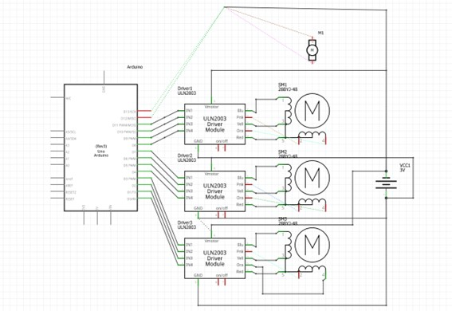
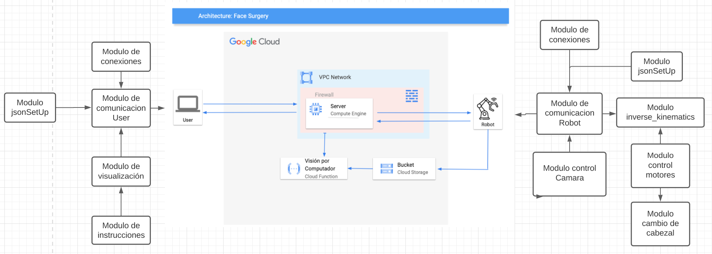

### Selecciona un idioma | Select a language:
* <a href="#catala">Català</a>
* <a href="#castellano">Castellano</a>
* <a href="#english">English</a>
---

  
<h1 id="catala"> MultiArm </h1>
Projecte conjunt de les assignatures de Robòtica (RLP), Visió per Computador (VC) i Sistemes Multimèdia (SM) en el qual hem desenvolupat un braç robotic amb visió per computador per a realitzar operacions quirúrgiques remotament via Internet.

# Table of Contents
   * [What is this?](#what-is-this)
   * [Requirements](#requirements)
     * [Hardware](#hardware)
     * [Software](#software)
   * [Documentation](#documentation)
   * [How to use](#how-to-use)
   * [Esquema del Hardware](#esquema-del-hardware)
   * [Arquitectura del Software](#arquitectura-del-software)

# What is this?

En aquest repositori es troba tot el codi, models del robot explicació necessaris per tal d'entendre què hem fet durant el procés de desenvolupament d'aquest projecte amb l'objectiu de poder replicar-lo i millorar-lo en un futur.

### Codi.
Trobem el codi separat en 3 carpetes principals:
- **Kinematics:** En aquesta carpeta es troba tot el codi d'Arduino desenvolupat.
- **cloud:** S'hi pot trobar el codi que s'ha d'executar per tal de controlar remotament el robot. Tenim el servidor, el client del robot, el client de l'usuari i l'aplicació.
- **Computer Vision:** Conté el codi implementat durant la realització de la pràctica de Visió per Computador, durant la qual vam implementar l'algorisme SIFT manual, el procés necessari per realitzar una primera reconstrucció donades dues imatges i la comparació de diversos algorismes similars.

# Requirements:

Descriurem els requeriments necessaris per portar a terme el nostre projecte, tant el muntatge del robot (sense comptar cables, cargols, etc) com 
l'execució del nostre Software amb les dependències o requeriments que comportin.

## Hardware:
- 3 x motor pas a pas (28BYJ-48)
- 3 x  Controladora de motors de pas a pas (28BYJ-48) (Controladora ULN2003 7 IN pins i de 5-12V)
- 1 x Micro Metal Gearmotor HP (micromotor de gir Continu)
- 1 x Controladora de motor (micromotor de gir) DF-MD V1.3
- 1 x Fuente de alimentación TACENS anima APII 500
- 1 x Placa de prototipo (Protoboard) 16,5x5,5cm
- 1 x Arduino UNO Rev.3
- 1 x Raspberry pi Zero
- 1 x Mòdul de càmera Raspberry Pi Camera v2

## Software:
- [Python 3.10.x](https://www.python.org/)
  - [NumPy](https://numpy.org/)
  - [PyGame](https://www.pygame.org/news)
  - [cv2 (openCV)](https://pypi.org/project/opencv-python/)
  - [time](https://docs.python.org/3/library/time.html)
  - [sys](https://docs.python.org/3/library/sys.html)
  - [socket](https://docs.python.org/3/library/socket.html)
  - [picamera](https://picamera.readthedocs.io/en/latest/)
  - [serial](https://pyserial.readthedocs.io/en/latest/)
  - [google-cloud](https://googleapis.dev/python/google-api-core/latest/index.html)
  - [google-cloud-storage](https://googleapis.dev/python/storage/latest/index.html)
  - [google-auth](https://google-auth.readthedocs.io/en/latest/)
  - [google-auth-oauthlib](https://google-auth-oauthlib.readthedocs.io/en/latest/)
  - [google.oauth2](https://google-auth.readthedocs.io/en/latest/reference/google.oauth2.html)
  - [json](https://docs.python.org/3/library/json.html)
- [Arduino IDE](https://www.arduino.cc/en/software)
  - [AccelStepper - Arduino Library](https://www.airspayce.com/mikem/arduino/AccelStepper/)
- [Google Cloud Platform (GCP)](https://cloud.google.com/gcp/)
  - [google-cloud-storage]
  - [functions-framework]
  - [Flask]
# Documentation:
Aquest README conté informació del nostre robot, i un context general de les parts de visió per computador i del Cloud, desenvolupat a Sistemes Multimèdia.
Si estàs interessat en conèixer més detalls dels respectius projectes, pots mirar:
* [Visió per Computador: Implementació de l'algorisme SIFT i modelat 3D](https://github.com/GerardGV/MultiArm/tree/main/Computer%20Vision) on aprofundim més sobre l'algorisme implementat per detectar punts característics de dues imatges i després visualitzar-los en l'aplicació.
* [Sistemes Multimèdia: Projecte al Cloud](https://github.com/GerardGV/MultiArm/tree/main/cloud) on aprofundim més sobre l'arquitectura de comunicacions desenvolupada en el Cloud allotjat a Google Cloud, l'aplicació, el seu funcionament i peticions amb el servidor realitzades.

# How to use:
1. Clone this repository.
    ```terminal
    git clone https://github.com/GerardGV/MultiArm.git
    ```
2. Install Python and the required libraries. 
    ```terminal
    pip install -r requirements.txt
    ```
3. Open the server (execute the cloud/server.py) file
    ```terminal
    python3 cloud/server.py
    ```
4. Open the App (execute the cloud/app.py)
    ```terminal
    python3 cloud/app.py
    ```
5. Open the clientRobot.py and turn on the Robot
    ```terminal
    python3 cloud/clientRobot.py
    ```
6. Enjoy!! 😄 TIP: You can check the Cloud folder README.md to understand the WorkFlow of our app. 

# Esquema del Hardware
<p align="center">
  
</p>

# Arquitectura del Software
<p align="center">
  
</p>
                                                                                           
                                                                               
# Authors:
* Pol Colomer Campoy (1605612) | PolKinsa
* Gerard Josep Guarin Velez (1605947) | GerardGV
* Jan Rubio Rico (1603753) | TheRospetit
* Rubén Simó Marin (1569391)
