### Autors | Autores | Authors:
* Pol Colomer Campoy (1605612)
* Gerard Josep Guarin Velez (1605947)
* Jan Rubio Rico (1603753)

### Selecciona un idioma | Select a language:
* <a href="#catala">Català</a>
* <a href="#castellano">Castellano</a>
* <a href="#english">English</a>
---
<h1 id="catala"> Sistemes Multimèdia - Projecte al Cloud </h1>
Per a la realització del nostre projecte de Sistemes Multimèdia, hem volgut realitzar una integració amb els nostres 
projectes de Robòtica (RLP) i Visió per Computador (VC).
Per al que correspon a aquesta assignatura, hem fet les connexions necessàries per a controlar remotament el 
robot, des d'una aplicació, que també hem implementat.

## Arquitectura:

Per a tal de poder controlar remotament el robot, hem desenvolupat una aplicació, la qual permet interactuar amb el 
robot. En comptes de permetre una connexió remota des d'una xarxa local, hem estructurat l'arquitectura de connexions
de tal manera que es pugui controlar des de qualsevol part del món amb una connexió a Internet.

A continuació es pot veure l'esquema d'aquesta arquitectura.

Tal com es pot observar, podem trobar un usuari (User -> `clientUser.py`), el robot (`clientRobot.py`) i al centre de 
tot, el Cloud, en el nostre cas, **Google Cloud**.

### Estructura del Google Cloud:

Primerament, tenim una instància de màquina virtual (VM) mitjançant l'API Compute Engine de 
Google Cloud (A partir d'ara, GC), en aquesta VM té una IP externa estàtica i es troba dins d'una VPC Network de GC, a
la qual li hem afegit les regles de Firewall necessàries per a permetre connexions als ports que realitzarem per a les 
connexions. 

Addicionalment, hi tenim una Cloud Function on tenim tot el codi desenvolupat en el projecte de Visió per Computador 
(hem posat el codi que es troba en la Cloud Function en el fitxer `tractament_imatges.py` per tal que es pugui 
visualitzar), per tal que es realitzin tots els càlculs al Cloud.  
Per a fer els càlculs necessaris, es necessiten dues 
imatges, fetes pel robot. És per això que mitjançant l'API Cloud Storage de GC hem utilitzat el Bucket per guardar-hi 
les imatges que després la Cloud Function utilitza per als càlculs.

### Flux de treball de l'aplicació.

A continuació intentarem realitzar un petit tutorial o llistat de passos que defineixin el flux de treball de l'aplicació:

1. **Obrir el servidor**. Primerament, s'haurà de confirmar que el servidor estigui obert escoltant les peticions tant 
de l'usuari com del robot.
2. **Obrir l'aplicació**. Quan s'obri l'aplicació, pot ser que la pantalla es quedi en negre durant 5 segons. Si això 
succeeix és perquè el primer pas `1.` no s'ha realitzat correctament. En aquest cas, es realitzarà una execució local 
per tal de provar l'aplicació, però no es podràn realitzar verificacions més enllà dels `prints` que es veuran pel 
terminal en realitzar les diverses accions. 

    

3. **Clicar el botó "Càmera"**.   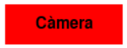  
Aquest botó envia una petició al servidor per a obtenir el núvol de punts 3D de la cara del pacient. Aleshores el 
servidor envia al clientRobot l'ordre de realitzar fotos, que fa que el robot faci dues fotografies i les guardi al
Buket, a continuació, la Cloud Function agafa aquestes dues imatges i começa tots els càlculs de la part de Visió per 
Computador i retorna el núvol de punts al servidor i aquest ho fa a l'aplicació.

D'aquesta manera, es carreguen els punts 3D i es visualitza d'una manera similar a aquesta:  
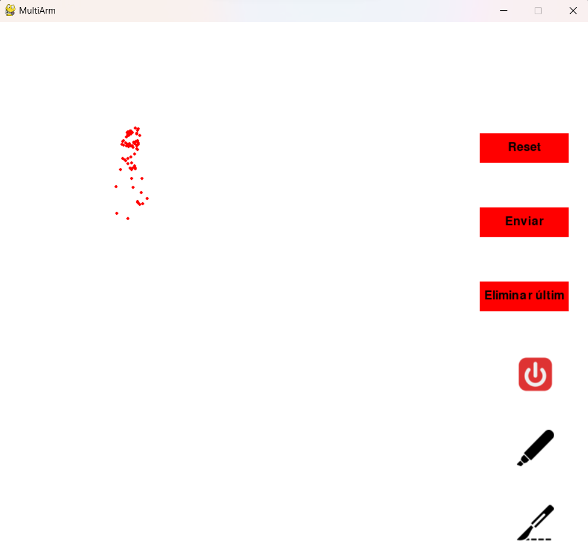

4. **Dibuixar un traç**. A continuació, mitjançant el ratolí es poden dibuixar diferents traçades.  
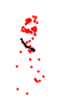 &nbsp;&nbsp;&nbsp;&nbsp; 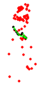
5. **Eliminar l'últim traç**. En cas d'equivocació, es permet esborrar l'últim traç dibuixat utilitzant el botó "Eliminar últim":
  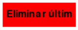  
A continuació mostrarem diverses traçades per tal de veure què passa en clicar el botó.
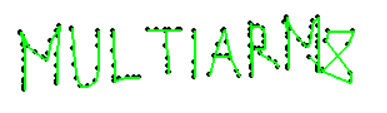 &nbsp;&nbsp;&nbsp;&nbsp; 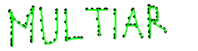  
Tal com es pot veure en les imatges anteriors, s'ha eliminat l'últim traç referent a la 'M'. Cal tenir en compte, que si es torna a clicar el botó, s'esborraria la 'R', després la 'A' i així succesivament.
Aquest botó no realitza cap petició al servidor, perquè simplement es tracta d'una funcionalitat extra de la mateixa App.
6. **Enviar**. Un cop s'estigui segur que l'última traçada és correcta i és la que volem que el robot realitzi, 
aleshores es pot clicar el botó "Enviar":
  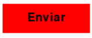   
Mitjançant aquest botó, si de la imatge anterior en la qual hem eliminat la 'M' que es veia malament, tornéssim a dibuixar una 'M' que ens sembli correcta i vulguem enviar, al clicar el botó enviar es veuria així:
 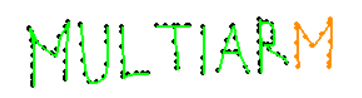  
  En aquest cas, l'aplicació ens indica mitjançant la línia taronja, que aquell traç s'ha enviat. El que realitza per darrere l'aplicació és:
Tracta els punts, els envia al servidor indicant la instrucció d'enviar, el servidor rep la instrucció i l'envia al clientRobot que finalment l'envia al robot físic que és el que es mourà als punts per tal de replicar 
la traçada realitzada des de l'aplicació.
7. **Reset**. Aquesta funcionalitat, digual manera que la d'Eliminar Últim, no realitza cap petició al Cloud, simplement és una funcionalitat extra de la mateixa aplicació.
En aquest cas, elimina totes les traçades de la pantalla, tant les enviades com les no enviades. És a dir, torna tot a l'estat del punt `3.` en el qual només es veuen els punts 3D de la part de Visió per Computador i els botons.
A continuació mostrem el seu funcionament: 
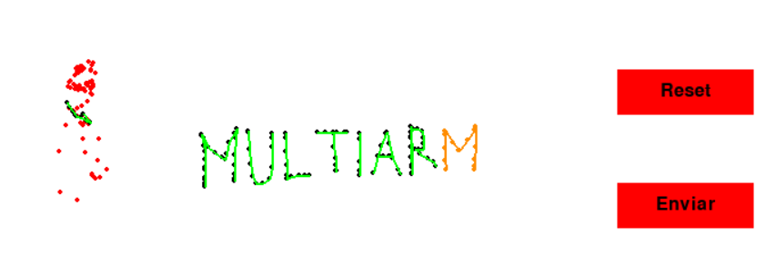 &nbsp;&nbsp;&nbsp;&nbsp; 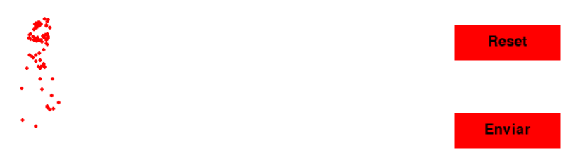
8. **Botons d'imatge**. Finalment, tenim els botons d'imatge, és a dir, els botons sense text que es tracten dels 3 de la cantonada dreta inferior.
 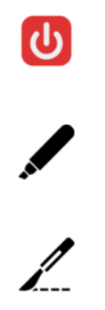
 
<ul>
<li> El primer de tots és el botó d'apagar, el qual envia una instrucció al servidor per apagar-se, el qual envia també al robot la instrucció d'apagar-se i els dos s'apaguen. L'apliació també es tanca. </li>
<li> El segon i el tercer funcionen de la mateixa manera. Són els botons de canvi de capçal. Aquests fan que el robot canviï el seu capçal a un retolador i un bisturí, respectivament.
L'aplicació envia una instrucció de canvi de capçal al servidor, aquest la rep i l'envia al clientRobot, que finalment l'envia al robot i aquest canvia el capçal.
</li></ul>

<h1 id="castellano">Castellano </h1>

