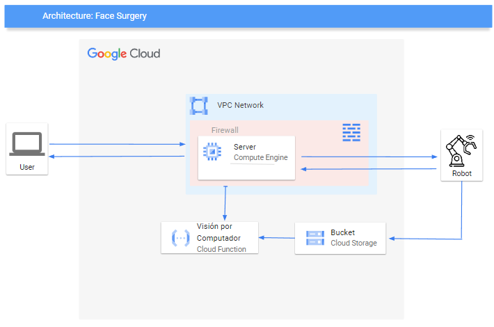

### Autors | Autores | Authors:
* Pol Colomer Campoy (1605612)
* Gerard Josep Guarin Velez (1605947)
* Jan Rubio Rico (1603753)

### Selecciona un idioma | Select a language:
* <a href="#catala">Català</a>
* <a href="#castellano">Castellano</a>
* <a href="#english">English</a>

<h1 id="catala"> Sistemes Multimèdia - Projecte al Cloud </h1>
Per a la realització del nostre projecte de Sistemes Multimèdia, hem volgut realitzar una integració amb els nostres 
projectes de Robòtica (RLP) i Visió per Computador (VC).
Per al que correspon a aquesta assignatura, hem fet les connexions necessàries per a controlar remotament el 
robot, des d'una aplicació, que també hem implementat.

## Arquitectura:

Per a tal de poder controlar remotament el robot, hem desenvolupat una aplicació, la qual permet interactuar amb el 
robot. En comptes de permetre una connexió remota des d'una xarxa local, hem estructurat l'arquitectura de connexions
de tal manera que es pugui controlar des de qualsevol part del món amb una connexió a Internet.

A continuació es pot veure l'esquema d'aquesta arquitectura.

Tal com es pot observar, podem trobar un usuari (User -> `clientUser.py`), el robot (`clientRobot.py`) i al centre de 
tot, el Cloud, en el nostre cas, **Google Cloud**.

### Estructura del Google Cloud:

Primerament, tenim una instància de màquina virtual (VM) mitjançant l'API Compute Engine de 
Google Cloud (A partir d'ara, GC), en aquesta VM té una IP externa estàtica i es troba dins d'una VPC Network de GC, a
la qual li hem afegit les regles de Firewall necessàries per a permetre connexions als ports que realitzarem per a les 
connexions. 

Addicionalment, hi tenim una Cloud Function on tenim tot el codi desenvolupat en el projecte de Visió per Computador 
(hem posat el codi que es troba en la Cloud Function en el fitxer `tractament_imatges.py` per tal que es pugui 
visualitzar), per tal que es realitzin tots els càlculs al Cloud.  
Per a fer els càlculs necessaris, es necessiten dues 
imatges, fetes pel robot. És per això que mitjançant l'API Cloud Storage de GC hem utilitzat el Bucket per guardar-hi 
les imatges que després la Cloud Function utilitza per als càlculs.

### Flux de treball de l'aplicació.

A continuació intentarem realitzar un petit tutorial o llistat de passos que defineixin el flux de treball de l'aplicació:

1. **Obrir el servidor**. Primerament, s'haurà de confirmar que el servidor estigui obert escoltant les peticions tant 
de l'usuari com del robot.
2. **Obrir l'aplicació**. Quan s'obri l'aplicació, pot ser que la pantalla es quedi en negre durant 5 segons. Si això 
succeeix és perquè el primer pas `1.` no s'ha realitzat correctament. En aquest cas, es realitzarà una execució local 
per tal de provar l'aplicació, però no es podràn realitzar verificacions més enllà dels `prints` que es veuran pel 
terminal en realitzar les diverses accions.

3. **Clicar el botó "Càmera"**.

<h1 id="castellano">Test </h1>

