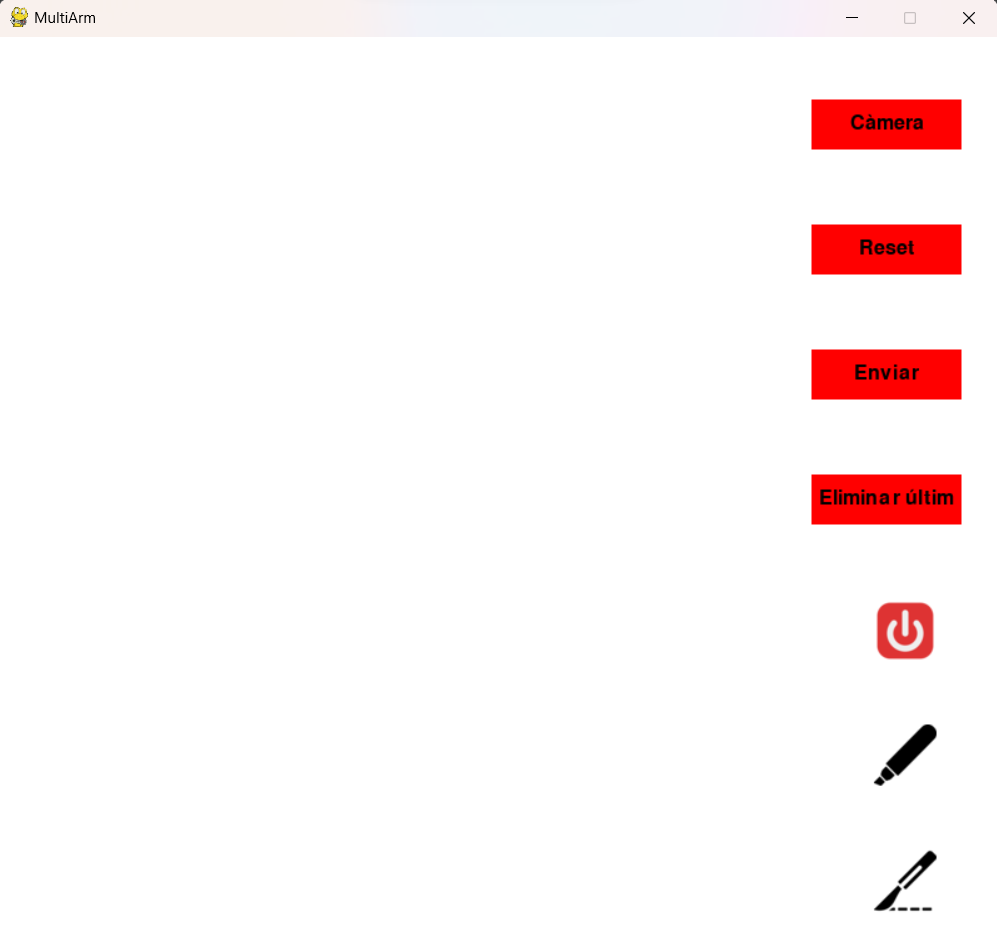

### Autors | Autores | Authors:
* Pol Colomer Campoy (1605612)
* Gerard Josep Guarin Velez (1605947)
* Jan Rubio Rico (1603753)

### Selecciona un idioma | Select a language:
* <a href="#catala">Català</a>
* <a href="#castellano">Castellano</a>
* <a href="#english">English</a>
---

<h1 id="catala">Flux de treball de l'aplicació</h1>

A continuació intentarem realitzar un petit tutorial o llistat de passos que defineixin el flux de treball de l'aplicació:

1. **Obrir el servidor**. Primerament, s'haurà de confirmar que el servidor estigui obert escoltant les peticions tant 
de l'usuari com del robot. 
2. **Obrir l'aplicació**. Quan s'obri l'aplicació, pot ser que la pantalla es quedi en negre durant 5 segons. Si això 
succeeix és perquè el primer pas `1.` no s'ha realitzat correctament. En aquest cas, es realitzarà una execució local 
per tal de provar l'aplicació, però no es podràn realitzar verificacions més enllà dels `prints` que es veuran pel 
terminal en realitzar les diverses accions. 

    
  
3. **Clicar el botó "Càmera"**.      
Aquest botó envia una petició al servidor per a obtenir el núvol de punts 2D de la cara del pacient. Aleshores el 
servidor envia al clientRobot l'ordre de realitzar fotos, que fa que el robot faci dues fotografies i les guardi al
Buket, a continuació, la Cloud Function agafa aquestes dues imatges i começa tots els càlculs de la part de Visió per 
Computador i retorna el núvol de punts al servidor i aquest ho fa a l'aplicació.

D'aquesta manera, es carreguen els punts 2D i es visualitza d'una manera similar a aquesta:  

  
4. **Dibuixar un traç**. A continuació, mitjançant el ratolí es poden dibuixar diferents traçades.  
 &nbsp;&nbsp;&nbsp;&nbsp;    
5. **Eliminar l'últim traç**. En cas d'equivocació, es permet esborrar l'últim traç dibuixat utilitzant el botó "Eliminar últim":
    
A continuació mostrarem diverses traçades per tal de veure què passa en clicar el botó.  
 &nbsp;&nbsp;&nbsp;&nbsp;   
Tal com es pot veure en les imatges anteriors, s'ha eliminat l'últim traç referent a la 'M'. Cal tenir en compte, que si es torna a clicar el botó, s'esborraria la 'R', després la 'A' i així succesivament.
Aquest botó no realitza cap petició al servidor, perquè simplement es tracta d'una funcionalitat extra de la mateixa App.
  
6. **Enviar**. Un cop s'estigui segur que l'última traçada és correcta i és la que volem que el robot realitzi, 
aleshores es pot clicar el botó "Enviar":
     
Mitjançant aquest botó, si de la imatge anterior en la qual hem eliminat la 'M' que es veia malament, tornéssim a dibuixar una 'M' que ens sembli correcta i vulguem enviar, al clicar el botó enviar es veuria així:
   
  En aquest cas, l'aplicació ens indica mitjançant la línia taronja, que aquell traç s'ha enviat. El que realitza per darrere l'aplicació és:
Tracta els punts, els envia al servidor indicant la instrucció d'enviar, el servidor rep la instrucció i l'envia al clientRobot que finalment l'envia al robot físic que és el que es mourà als punts per tal de replicar 
la traçada realitzada des de l'aplicació.
  
7. **Reset**. Aquesta funcionalitat, digual manera que la d'Eliminar Últim, no realitza cap petició al Cloud, simplement és una funcionalitat extra de la mateixa aplicació.
En aquest cas, elimina totes les traçades de la pantalla, tant les enviades com les no enviades. És a dir, torna tot a l'estat del punt `3.` en el qual només es veuen els punts 2D de la part de Visió per Computador i els botons.
A continuació mostrem el seu funcionament:  
 &nbsp;&nbsp;&nbsp;&nbsp; 
  
8. **Botons d'imatge**. Finalment, tenim els botons d'imatge, és a dir, els botons sense text que es tracten dels 3 de la cantonada dreta inferior.
 
 
<ul>
<li> El primer de tots és el botó d'apagar, el qual envia una instrucció al servidor per apagar-se, el qual envia també al robot la instrucció d'apagar-se i els dos s'apaguen. L'apliació també es tanca. </li>
<li> El segon i el tercer funcionen de la mateixa manera. Són els botons de canvi de capçal. Aquests fan que el robot canviï el seu capçal a un retolador i un bisturí, respectivament.
L'aplicació envia una instrucció de canvi de capçal al servidor, aquest la rep i l'envia al clientRobot, que finalment l'envia al robot i aquest canvia el capçal.
</li></ul>
 
<h1 id="castellano">Flujo de trabajo de la aplicación</h1> 

A continuación intentaremos realizar un pequeño tutorial o listado de pasos que definan el flujo de trabajo de la aplicación:

1. **Abrir el servidor**. En primer lugar, deberá confirmarse que el servidor esté abierto escuchando las peticiones tanto
del usuario como del robot. 

2. **Abrir la aplicación**. Cuando se abra la aplicación, puede que la pantalla se quede en negro durante 5 segundos. Si esto
sucede es porque el primer paso `1.` no se ha realizado correctamente. En este caso, se realizará una ejecución local
para probar la aplicación, pero no se podrán realizar verificaciones más allá de los `prints` que se verán por el
terminal al realizar las diversas acciones.

  

3. **Clicar el botón "Cámara"**.     
Este botón envía una petición al servidor para obtener la nube de puntos 2D de la cara del paciente. Entonces el
servidor envía al clienteRobot el orden de realizar fotos, que hace que el robot haga dos fotografías y las guarde en
Buket, a continuación, la Cloud Function toma estas dos imágenes y comienza todos los cálculos de la parte de Visión por
Computador y devuelve la nube de puntos al servidor y éste lo hace en la aplicación.

De este modo, se cargan los puntos 2D y se visualiza de una manera similar a ésta:  

  

4. **Dibujar un trazo**. A continuación, mediante el ratón se pueden dibujar diferentes trazadas.  
         
5. **Eliminar el último trazo**. En caso de equivocación, se permite borrar el último trazo dibujado utilizando el botón "Eliminar último":
    
A continuación mostraremos varias trazadas para ver qué ocurre al pulsar el botón.  
        
Tal y como puede verse en las imágenes anteriores, se ha eliminado el último trazo referente a la 'M'. Hay que tener en cuenta, que si se vuelve a pulsar el botón, se borraría la 'R', después la 'A' y así sucesivamente.
Este botón no realiza ninguna petición en el servidor, porque simplemente se trata de una funcionalidad extra de la misma App.
  
6. **Enviar**. Una vez se esté seguro de que la última trazada es correcta y es la que queremos que el robot realice,
entonces se puede clicar el botón "Enviar":
     
Mediante este botón, si de la imagen anterior en la que hemos eliminado la 'M' que se veía mal, volviéramos a dibujar una 'M' que nos parezca correcta y queramos enviar, al clicar el botón enviar se vería así:
 
  En este caso, la aplicación nos indica mediante la línea naranja, que ese trazo se ha enviado. Lo que realiza por detrás de la aplicación es:
Trata los puntos, los envía al servidor indicando la instrucción de enviar, el servidor recibe la instrucción y la envía al clienteRobot que finalmente le envía al robot físico que es lo que se moverá a los puntos para replicar
la trazada realizada desde la aplicación.
  
7. **Reset**. Esta funcionalidad, igual que la de Eliminar Último, no realiza ninguna petición al Cloud, simplemente es una funcionalidad extra de la misma aplicación.
En este caso, elimina todos los trazos de la pantalla, tanto los enviados como los no enviados. Es decir, vuelve todo al estado del punto `3.` en el que sólo se ven los puntos 2D de la parte de Visión por Computador y los botones.
A continuación mostramos su funcionamiento:    
      
  
8. **Botones de imagen**. Por último, tenemos los botones de imagen, es decir, los botones sin texto que se tratan de los 3 de la esquina derecha inferior.
 
 

<ul>
 <li>El primero de todos es el botón de apagar, que envía una instrucción al servidor para apagarse, el cual envía también al robot la instrucción de apagarse y los dos se apagan. La aplicación también se cierra.</li> 
 <li>El segundo y el tercero funcionan de la misma manera. Son los botones de cambio de cabezal. Éstos hacen que el robot cambie su cabezal a un rotulador y un bisturí, respectivamente.
La aplicación envía una instrucción de cambio de cabezal al servidor, éste la recibe y la envía al clienteRobot, que finalmente la envía al robot y éste cambia el cabezal.
</li></ul>

<h1 id="english">Application workflow</h1>

Next we will try to make a small tutorial or list of steps that define the workflow of the application:

1. **Open the server**. First, you will have to confirm that the server is open by listening to both requests
of the user as of the robot. 

2. **Open the application**. When the app opens, the screen may go black for 5 seconds. if that
happens is because the first step `1.` was not performed correctly. In this case, a local execution will be performed
in order to test the application, but it will not be possible to carry out checks beyond the `prints' that will be seen by
terminal when performing the various actions.

  

3. **Click the "Camera" button**.    
This button sends a request to the server to get the 2D point cloud of the patient's face. Then the
server sends the clientRobot the command to take photos, which causes the robot to take two photos and save them to the
Buket, then the Cloud Function takes these two images and starts all the calculations on the Vision part for
Computer and returns the point cloud to the server and the server does it to the application.

This loads the 2D points and displays something similar to this:  

  

4. **Draw a stroke**. Then, using the mouse, different paths can be drawn. 
         
5. **Remove the last stroke**. In case of a mistake, it is possible to delete the last stroke drawn using the "Delete last" button: 
   
Below we will show several traces to see what happens when the button is clicked.
        
As you can see in the previous images, the last stroke referring to the 'M' has been removed. Note that if the button is clicked again, the 'R' will be deleted, then the 'A' and so on.
This button does not make any request to the server, because it is simply an extra functionality of the App itself.
  
6. **Submit**. Once you are sure that the last trace is correct and is the one we want the robot to perform,
then you can click the "Send" button:
     
Using this button, if from the previous image in which we removed the 'M' that looked bad, we re-draw an 'M' that seems correct and we want to send, when clicking the send button it would look like this:
 
  In this case, the application tells us through the orange line, that that stroke has been sent. What the application does behind the scenes is:
It processes the points, sends them to the server indicating the send instruction, the server receives the instruction and sends it to the clientRobot which finally sends it to the physical robot which is the one that will move to the points in order to replicate
the tracing made from the application.
  
7. **Reset**. This functionality, like the Delete Last one, does not make any request to the Cloud, it is simply an extra functionality of the same application.
In this case, it removes all traces from the screen, both sent and unsent. That is, it returns everything to the state of point `3.` in which only the 2D points of the Computer Vision part and the buttons are visible.
Below we show how it works:
      
  
8. **Image Buttons**. Finally, we have the image buttons, i.e. the buttons without text which are the 3 in the lower right corner.
 
 

<ul>
 <li>First of all is the shutdown button, which sends an instruction to the server to shutdown, which also instructs the robot to shutdown, and both shut down. The application is also closed.</li> 
 <li>The second and third work the same way. These are the header change buttons. These cause the robot to change its head to a marker and a scalpel, respectively.
The application sends a head change instruction to the server, which receives it and sends it to the clientRobot, which finally sends it to the robot, which changes the head.
</li></ul>
